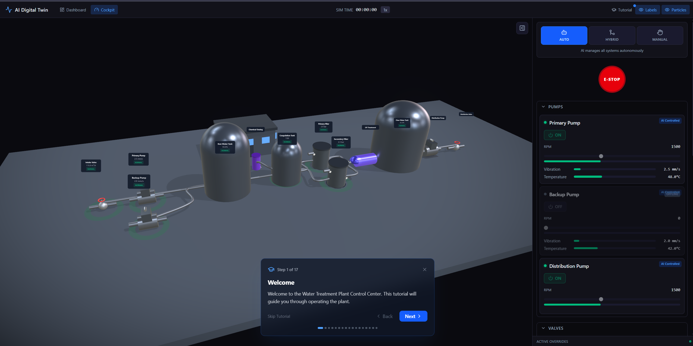
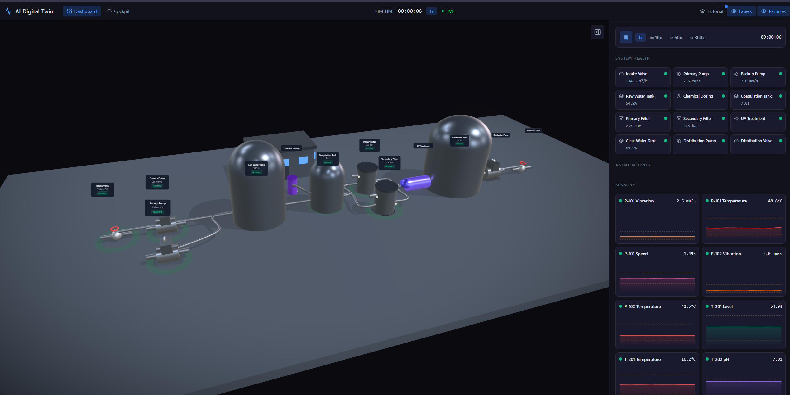

<div align="center">

# AI Digital Twin Platform

### Take Control of a Virtual Water Treatment Plant

A real-time 3D simulation with manual cockpit controls, AI-powered monitoring, and autonomous fault detection — all running in your browser.

[](https://www.typescriptlang.org/)
[](https://react.dev/)
[](https://threejs.org/)
[](https://www.docker.com/)
[](LICENSE)

</div>

---

## Cockpit — Your Control Center

Switch to the **Cockpit** tab and take the operator's seat. This isn't a passive dashboard — you directly control every pump, valve, and dosing system in the plant. Adjust RPMs, open and close valves, tune chemical dosing, and react to emergencies in real time.

<div align="center">


*Cockpit with manual pump controls, E-STOP, and the interactive tutorial guiding new operators*

</div>

### Control Modes

| Mode | Icon | Who's in charge | What happens |
|------|------|-----------------|--------------|
| **Manual** | :raised_hand: | You | Full hands-on control of every system. The AI steps back. |
| **Hybrid** | :left_right_arrow: | You + AI | The AI monitors and suggests actions — you decide what gets executed. |
| **Auto** | :robot_face: | AI | Fully autonomous. The AI detects, predicts, and acts without intervention. |

### What You Can Control

| System | Controls | Live Feedback |
|--------|----------|---------------|
| **Pumps** (P-101, P-102, P-401) | Start/stop toggle, RPM slider (0–3,600) | Vibration, temperature, flow rate gauges |
| **Valves** (V-101, V-401) | Position slider (0–100%), Quick Open/Close | Real-time flow rate |
| **Chemical Dosing** (D-501) | Target pH (+/- 0.1 steps), dosing rate slider | Live pH reading, deviation indicator |
| **Filters** (F-301, F-302) | Active/Standby toggle, Backwash mode, Switch to Backup | Pressure differential, flow rate |

### Emergency Stop

The **E-STOP** is always one click away. It immediately shuts down all pumps and closes all valves — regardless of which control mode is active. Press it again to reset and resume.

---

## Dashboard — Monitor Everything

The Dashboard gives you a bird's-eye view of the entire plant: real-time sensor charts, AI agent activity, system health, fault injection, and cost tracking.

<div align="center">


*Dashboard showing system health overview, sensor grids with live data, and simulation controls*

</div>

### Dashboard Panels

- **System Health** — Equipment cards with color-coded status dots (green/amber/red)
- **Sensor Grid** — Live charts for all 14 sensors with warning thresholds
- **Agent Log** — Every AI detection, prediction, and action with confidence scores
- **AI Thinking** — Step-by-step reasoning display when the agent is analyzing
- **Anomaly Timeline** — History of detected anomalies
- **Cost Tracker** — Estimated cost avoidance from AI interventions
- **Fault Injector** — One-click failure scenarios + Auto Demo mode

---

## AI Agent System

The built-in AI agent monitors all 14 sensor streams at 1 Hz, detects anomalies using z-score analysis, identifies cross-sensor correlation breaks, and predicts remaining useful life for degrading equipment.

### How It Works

| Step | What It Does | Example |
|------|-------------|---------|
| **1. Detection** | Z-score anomaly flagging on rolling window | *"P-101 Vibration at 8.2 mm/s is 2.8σ above rolling mean"* |
| **2. Correlation** | Cross-sensor divergence analysis | *"Vibration rising but RPM constant — inconsistent with normal operation"* |
| **3. Prediction** | Linear/exponential regression to threshold | *"Bearing failure predicted in ~4.2 hours (87% confidence)"* |
| **4. Action** | Corrective intervention or recommendation | *"Reducing P-101 speed to 1050 RPM to limit further damage"* |

In **Auto** mode, the agent executes actions immediately. In **Hybrid** mode, actions appear as suggestions in the log. In **Manual** mode, the agent still monitors and warns, but never touches the controls.

Every decision is explained in natural language — no black boxes.

---

## Interactive Tutorial

A 17-step guided walkthrough teaches new operators how to run the plant. It starts automatically on first visit and covers:

- Navigation and camera controls
- Switching between control modes
- Operating pumps (RPM, start/stop)
- Adjusting valves and chemical dosing
- Managing filters and backwash
- Emergency stop procedures
- Fault injection and AI monitoring

Progress is saved in `localStorage`. The tutorial button in the header lets you restart it anytime.

---

## 3D Visualization

The entire plant is rendered in real-time 3D using Three.js and react-three-fiber:

- **12 equipment pieces** — Tanks with animated water levels, pumps with RPM-driven rotation, valves, filters, UV treatment with purple glow, chemical dosing, control room building
- **Health glow rings** — Green (normal), pulsing amber (warning), rapid red (critical) with bloom post-processing
- **Water particles** flowing through the pipe network, speed driven by flow sensors
- **Interactive camera** — Click equipment to zoom in, use preset views (Overview, Intake, Treatment, Distribution)
- **Floating labels** — Equipment names, sensor values, and health badges

---

## Quick Start

```bash
# Clone the repository
git clone <repo-url>
cd ai-digital-twin-platform

# Start with Docker
docker compose up --build

# Open in browser — the app runs at:
# http://localhost:5174
```

### First Steps

1. The **tutorial starts automatically** on first visit — follow it to learn the controls
2. Click **Play** to start the simulation
3. Switch to the **Cockpit** tab to take manual control
4. Set mode to **Manual** and adjust pump RPMs, valve positions, and dosing
5. Switch to **Dashboard** to monitor sensors and inject faults
6. Try **Auto Demo** in the Fault Injector to see the AI in action

---

## Architecture

```
┌─────────────┐     ┌──────────────┐     ┌─────────────┐
│  3D Scene   │◄────│   Zustand    │────►│  Dashboard  │
│  (R3F)      │     │   Stores     │     │  / Cockpit  │
└─────────────┘     └──────┬───────┘     └─────────────┘
                           │
                    ┌──────┴───────┐
                    │              │
              ┌─────▼─────┐ ┌─────▼─────┐
              │ Simulation │ │ AI Agent  │
              │ Engine     │ │ System    │
              └───────────┘ └───────────┘
```

**Data flow:** Simulation Engine generates sensor readings → Zustand stores → 3D scene animates equipment + Dashboard/Cockpit show data → AI Agent monitors at 1 Hz → actions feed back into stores → next tick picks them up.

### Plant Layout

```
INTAKE           RAW WATER       TREATMENT          CLEAR WATER     DISTRIBUTION
V-101 ► P-101 ► T-201 ► D-501 ► T-202 ► F-301 ► U-601 ► T-303 ► P-401 ► V-401
          P-102                          ► F-302
```

---

## Tech Stack

| Layer | Technology | Why |
|-------|-----------|-----|
| 3D Rendering | Three.js + react-three-fiber + drei | Best React integration, HDR environments, orbit controls |
| UI Framework | React 18 + TypeScript | Type safety, component model |
| Styling | Tailwind CSS v4 | Utility-first, zero config with Vite plugin |
| State | Zustand | Lightweight, selective subscriptions for 60fps |
| Charts | Recharts | Real-time sensor visualization |
| Build | Vite | Fast HMR, modern defaults |
| Icons | lucide-react | Clean industrial icons |
| Runtime | Docker | Zero-setup development |

No backend required — everything runs client-side.

---

## Sensor Reference

| Sensor ID | Equipment | Type | Unit | Normal Range | Warning Range |
|-----------|-----------|------|------|-------------|---------------|
| S-P101-VIB | P-101 Primary Pump | Vibration | mm/s | 0.5 – 4.5 | 0 – 7.0 |
| S-P101-TEMP | P-101 Primary Pump | Temperature | °C | 35 – 65 | 25 – 80 |
| S-P101-RPM | P-101 Primary Pump | RPM | RPM | 1,400 – 1,800 | 1,000 – 2,200 |
| S-P102-VIB | P-102 Backup Pump | Vibration | mm/s | 0.5 – 4.5 | 0 – 7.0 |
| S-P102-TEMP | P-102 Backup Pump | Temperature | °C | 35 – 65 | 25 – 80 |
| S-T201-LVL | T-201 Raw Water Tank | Level | % | 30 – 80 | 15 – 90 |
| S-T201-TEMP | T-201 Raw Water Tank | Temperature | °C | 12 – 22 | 5 – 28 |
| S-T202-PH | T-202 Coagulation Tank | pH | pH | 6.5 – 7.5 | 6.0 – 8.0 |
| S-T202-TURB | T-202 Coagulation Tank | Turbidity | NTU | 0 – 4.0 | 0 – 8.0 |
| S-F301-PRES | F-301 Primary Filter | Pressure | bar | 1.5 – 3.5 | 1.0 – 5.0 |
| S-F301-FLOW | F-301 Primary Filter | Flow Rate | m³/h | 80 – 140 | 50 – 160 |
| S-F302-PRES | F-302 Secondary Filter | Pressure | bar | 1.5 – 3.5 | 1.0 – 5.0 |
| S-T303-LVL | T-303 Clear Water Tank | Level | % | 40 – 85 | 20 – 95 |
| S-V101-FLOW | V-101 Intake Valve | Flow Rate | m³/h | 80 – 140 | 50 – 160 |

---

## Failure Scenarios

| Scenario | Category | Affected Equipment | What Happens | AI Detection |
|----------|----------|--------------------|-------------|-------------|
| **Pump Bearing Degradation** | Mechanical | P-101 | Vibration rises exponentially, temperature increases, flow drops | ~15 s |
| **Filter Clogging** | Process | F-301, T-202 | Pressure differential grows, flow drops, downstream turbidity rises | ~20 s |
| **Chemical Imbalance** | Chemical | D-501, T-202 | pH drifts, coagulation fails, turbidity spikes | ~10 s |
| **Tank Overflow Risk** | Hydraulic | V-101, T-201 | Intake stuck open, level rising toward overflow | ~12 s |
| **Cascading Failure** | Systemic | P-101, F-301, T-201, T-303 | Pump degradation triggers downstream effects across entire plant | ~20 s |

---

## Development

### Prerequisites

- Docker & Docker Compose

### Commands

```bash
docker compose up --build                    # Start dev server
docker compose exec app npm run build        # Production build
docker compose exec app npx tsc --noEmit     # Type check
```

### Project Structure

```
src/
├── components/
│   ├── scene/           # 3D visualization (Three.js / R3F)
│   ├── dashboard/       # Monitoring panels, charts, AI log
│   ├── cockpit/         # Manual control interface
│   └── layout/          # App shell, header, tabs
├── engine/
│   ├── simulation/      # Physics-based sensor engine
│   ├── ai/              # AI agent (anomaly, prediction, decisions)
│   └── store/           # Zustand state management (5 stores)
├── types/               # TypeScript definitions
├── config/              # Plant layout, sensors, scenarios, tutorial
└── utils/               # Math, colors, formatting
```

---

## License

MIT

---

<p align="center">
  Built with <a href="https://threejs.org/">Three.js</a>, <a href="https://react.dev/">React</a>, and <a href="https://claude.ai/claude-code">Claude Code</a>.
</p>
